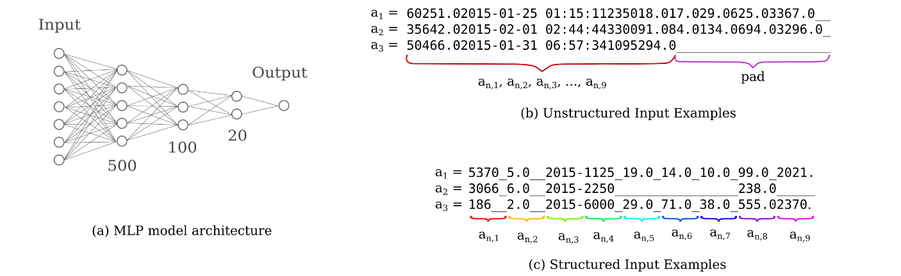

## small-language-models

Code for the paper 'Small Language Models for Tabular Data', which may be accessed on [arxiv](https://arxiv.org/abs/2211.02941).

### General Details

This repository provides code for the modeling of arbitrary tabular datasets (assuming ASCII character encodings that is) via deep learning, an approach that seems to be remarkably effective even for poorly composed datasets.  The paper linked above provides one particular example of this, in which a small model with no data formatting, normalization, or cleaning is capable of achieving record Titanic challenge accuracy and performs better than ensemble approaches using carefully curated classical ML models.  This phenomenon has been observed to extend to a variety of private datasets in the author's experience, although some formatting is necessary for very large numerical inputs.

Note that this is research code and is not currently productionized.  In particular, there are non-optimal approaches taken in the data encoding steps (for example, the `data_formatter.Format` class iterates through all specified rows of the tabular data in question sequentially) that make this code somewhat slow for large tables.  This will hopefully be amended in the near future to allow for fast encoding of as large a dataset as can fit in memory.

The `fcnet.py` module contains code for exploring model embeddings, whereas the `fcnet_original.py` is a better place to start for exploring the capability of direct character encoding.  `fcnet_original.py` also contains class methods that allow for the visualization of the gradient field for specified parameters, work that did not make it into the paper linked but instead may be found on this [blog post](https://blbadger.github.io/gradient-landscapes.html).

As one might expect, `fcnet_categorical.py` and `transformer_categorical.py` contain code for applying the structured sequence encoding method to datasets with categorical outputs such as the well-known [Titanic](https://www.kaggle.com/c/titanic) dataset, which is supplied for convenience.  All models now support use for arbitrary strings as well as a limited character set (numerical and some special characters) for decreased embedding size.

### More Information

For more information on the theory behind the architectures used as well as more thorough implementation details, see this [technical blog](https://blbadger.github.io/neural-networks3.html), and for more details on input attribution see [here](https://blbadger.github.io/nn_interpretations.html).
